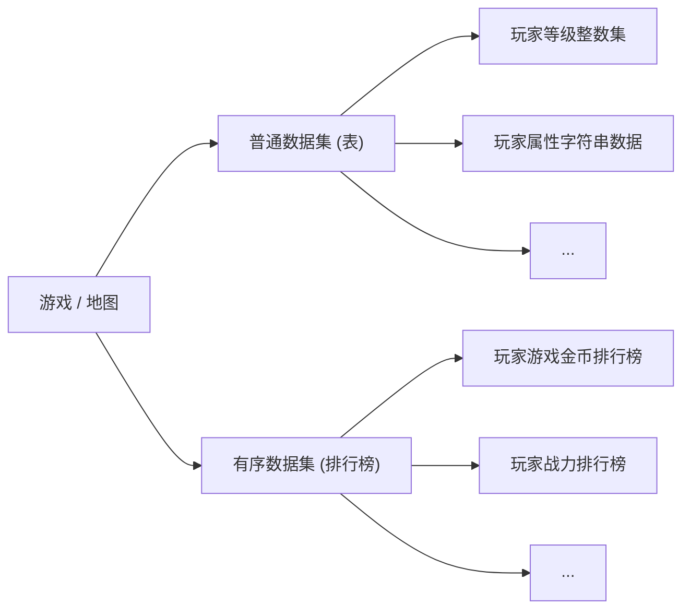

# UGC.md

- 如果不确定API名称、常量名等，请使用官方常用接口，不要编造不存在的函数、常量等信息
- 迷你世界 UGC 3.0
- `触发器` 指 `UGC 3.0` 的图形化编程
- `云服` 指 官方给UGC内容分配的服务器
- MiniUGC 的 Lua 是基于 Lua5.1 的
- 具体接口请查看 `MNDeclaration.d.lua` 或 `MNAiDesc.txt`

## 脚本开头结尾

- 脚本开头/结尾 **必须** 写:

```lua
local Script = {}
  -- 你的代码
return Script
```

## 脚本入口

```lua
function 你的表名:OnStart()
end
```

> OnStart函数是 **最先启动** 的 -> OnStart 是 **主入口**

- PS: 你的组件表不可设置元表，其他的表可以设置

## 其他特性

- UGC 拥有 `goto` 语句
- 可使用 `pcall()`
- `debug` 库已被精简

## UGC API调用

- 类名:API名(...)
- API名(...)

1. 例示

  '''lua
  CustomUI:HideElement(1001, "114-514", "114-514_1")
  '''
2. 例示

  '''lua
  GetWorld()
  '''

- PS: 可以将 `API` 全局局部化，以此提升性能

## os库

- 在 UGC 中只有 `time()` `timeMs()` `data()` 这三个函数

## 玩家退出资源管理

- 玩家退出游戏时，`UGCS` 会自动释放大部分与该玩家直接相关的资源:
  1. 打开的 UI & 元件
  2. 事件监听/定时器
  3. ...
- 当全部玩家退出时，过一段时间此云服将会直接关闭，释放所有资源

## 玩家的ID (Uin)

- `玩家的ID` 为他的迷你号，为一串数字

## 事件注册/删除

- 此函数只在 `UI` 与 `世界组件` 生效

### 事件注册与删除

| 操作 | 方法 | 参数 | 返回 | API调用 | 备注 |
| :-: | :-: | :-: | :-: | :-: | :-: |
| 事件注册 | 方法1 | 事件类型: string, 回调函数: function, 过滤参数1(可选): number/string, 过滤参数2(可选): number/string | 无返回 | `self:AddTriggerEvent(事件枚举常量, 回调函数, 过滤参数1, 过滤参数2)` | 仅可监听官方的触发器事件 |
| 事件注册 | 方法2 | 事件类型: string, 回调函数: function, 优先级(可选): number, 过滤参数1(可选): number/string, 过滤参数2(可选): number/string | 无返回 | `self:AddEvent(事件枚举常量 或 自定义消息(广播), 回调函数, 优先级, 过滤参数1, 过滤参数2)` | 可监听官方的组件事件，也可监听自定义消息(广播) |
| 事件删除 | 方法1 | 事件类型: string | 无返回 | `self:RemoveTriggerEvent(事件枚举常量)` | - |
| 事件删除 | 方法2 | 事件类型: string | 无返回 | `self:RemoveEvent(事件枚举常量 或 自定义消息(广播))` | - |

### 事件枚举

- 事件枚举参考: `MNDeclaration.d.lua` 中的:

  | 名称 |
  | :-: |
  | TriggerEvent |
  | CurEventParam |
  | ObjectEvent |

### 事件回调函数

- 回调函数仅需接收一个 `event` 参数 (表类型，包含事件信息，可修改为任意合法标识符), 通常无 `nil` 无需检查
- 例如:

  ```lua
  local Script = {}

  function Script:OnStart()
    self:AddTriggerEvent(TriggerEvent.PlayerClickBlock, self.OnPlayerClickBlock) -- 注册事件
  end

  function Script:OnPlayerClickBlock(event) -- 玩家点击方块回调
    local block, playerUin = event.blockid, event.eventobjid
    print("玩家[".. playerUin .."]点击了方块，类型ID: ".. block)
  end

  return Script
  ```

## 发送/添加/监听/移除监听消息(广播)

- `消息ID`: 需要在触发器界面先定义消息(广播), 获取由系统生成的ID
- `参数类型` & `参数数量`: 需要跟触发器定义$的消息(广播)对应上

| 操作 | 类型 | 参数 | 返回 | API调用 | 备注 |
| :-: | :-: | :-: | :-: | :-: | :-: |
| 普通异步消息 | 异步 | 消息ID: string, N个参数 | 无返回 | `self:PushCustomEvent(消息ID, ...)` | - |
| 普通同步消息 | 同步 | 消息ID: string, N个参数 | 无返回 | `self:PushCustomEventSync(消息ID, ...)` | - |
| 添加监听消息 | - | 事件类型: string, 回调函数: function, 优先级(可选): number, 过滤参数1(可选): number/string, 过滤参数2(可选): number/string | 无返回 | `self:AddEvent(事件枚举常量 或 自定义消息(广播), 回调函数, 优先级, 过滤参数1, 过滤参数2)` | 可监听官方的事件，也可监听自定义消息(广播) |
| 移除监听消息 | - | 事件类型: string | 无返回 | `self:RemoveEvent(事件枚举常量 或 自定义消息(广播))` | 可移除监听官方的事件，也可移除监听自定义消息(广播) |
| 云服异步消息 | 异步 | 消息ID: string, N个参数 | 无返回 | `self:PushCloudServerMsg(消息ID, ...)` | 只有同个对象上监听的组件才能收到事件 |
| 添加监听云服消息 | - | 事件类型: string, 回调函数: function | 无返回 | `self:AddCloudSeverEvent(事件枚举常量 或 自定义云服消息(广播), 回调函数)` | - |
| 移除监听云服消息 | - | 事件类型: string | 无返回 | `self:RemoveCloudSeverEvent(事件枚举常量 或 自定义消息(广播))` | - |

## 坐标系

- 坐标系为：`X Y Z`
  - X: E为增加，W为减少
  - Y: 上为增加，下为减少
  - Z: N为增加，S为减少

## 天空盒 / 环境设置

- 环境 (天空盒) 用于控制世界的视觉氛围，包括天空颜色/光照/云雾/水面/太阳/月亮等效果
- 与滤镜不同: 环境改的是 `世界本身的景物`，滤镜改的是 `画面呈现效果`; 两者可以同时使用
- 通过模板一键套用环境预设，也可以逐项调节某个时间段的参数

### 模版

| 编号 | 名称 | 风格氛围 |
| :-: | :-: | :-: |
| 0 | 空模板 | 不启用环境 |
| 1 | 经典 | 通用写实白天 |
| 2 | 卡通风格 | 卡通可爱明快 |
| 3 | 自然过渡 | 自然写实柔和 |
| 4 | 梦幻粉 | 梦幻粉色唯美 |
| 5 | 冰雪蓝 | 冰雪寒冷冷调 |
| 6 | 烈焰红 | 炽热红色危险 |
| 7 | 废土黄 | 废土荒凉末世 |
| 8 | 科幻灰 | 科幻赛博冷调 |
| 9 | 毒雾绿 | 毒雾诡异绿色 |
| 10 | 水墨 | 水墨国风黑白 |
| 11 | 青山绿水 | 水墨国风青绿 |
| 12 | 森林 | 森林绿意自然 |
| 13 | 沙漠 | 沙漠干旱暖黄 |
| 14 | 冰原 | 冰原寒冷冷白 |
| 15 | 沼泽 | 沼泽阴湿暗绿 |
| 16 | 火山 | 火山炽热红黑 |
| 17 | 雨林 | 雨林湿润浓绿 |
| 18 | 丛林 | 丛林茂密绿 |
| 19 | 针叶林 | 针叶林冷绿高纬 |
| 20 | 高山 | 高山高远冷蓝 |
| 21 | 海洋 | 海洋蔚蓝开阔 |
| 22 | 空岛 | 空岛天空悬浮 |
| 23 | 盆地 | 盆地低地柔和 |
| 24 | 草原 | 草原开阔绿黄 |
| 25 | 热带草原 | 热带温暖黄绿 |
| 26 | 发光空岛 | 发光奇幻绚丽 |

### 时间

| 时间段 | 大致时刻 | 感受 |
| :-: | :-: | :-: |
| 午夜 | 0h | 深夜/最暗 |
| 黎明前 | 4h | 将亮未亮 |
| 日出 | 6h | 天边泛光 |
| 清晨 | 8h | 明亮清新 |
| 正午 | 12h | 最亮 |
| 下午 | 16h | 偏暖 |
| 黄昏 | 18h | 日落/橙红 |
| 夜晚 | 20h | 入夜/繁星 |

### 示例

```lua
local Script = {}

function Script:OnStart()
  World:SetSkyBoxTemplate(1) -- 切换到“经典”环境模板
  World:SetSkyBoxColor(SkyboxTime.TimeAll, SkyboxColor.Top, 0x87CEEB) -- 设置全天的天空顶部颜色为浅蓝色
  World:SetSkyBoxAttr(SkyboxTime.TimeAll, SkyboxAttr.CloudDensity, 50) -- 设置全天的云密度
  World:SetSkyBoxSwitch(SkyboxTime.TimeAll, SkyboxSwitch.Fogenable, 1) -- 打开雾效果
end

return Script
```

## 组件的互操作

- 组件A:

  ```lua
  local Script = {}
  Script.openFnArgs = {
    Add = {
      returnType = Mini.Number，
      displayName = "别名",
      params = {Mini.Number, Mini.Number},
    }
  }

  -- 函数定义示例
  function Script:Add(a, b)
    if a and b then
      return a + b
    end
  end

  -- 组件启动时调用
  function Script:OnStart()
    -- 调用自己定义的函数示例
    -- PS:调用本组件的函数不需要任何配置
    local result = self:Add(1, 2)
    print("result", result)
  end

  return Script
  ```

- 组件B:

  ```lua
  local Script = {}
  function Script:OnStart()
    -- 同对象下操作

    -- 获取对象上组件A
    local cmpA = self:GetComponent("组件id")

    -- 调用组件A的函数
    local result = cmpA:Add(1, 2)
    print("result", result)

    -- 跨对象操作
    local obj = GameObject:FindObject("对象id") -- 获取一般对象    
    local world = GetWorld() -- 世界对象的获取方式

    -- 获取对象上组件A
    local cmpA = world:GetComponent("组件id")

    -- 调用组件A的函数
    local result = cmpA:Add(1, 2)
    print("result", result)
  
    local age = cmpA.age -- 获取cmpA组件的age属性
    cmpA.age = 123 -- 设置cmpA的age属性值为123
  end
  return Script -- 返回组件定义的表
  ```

## 等待

1. 方法1:

    ```lua
    self:ThreadWait(time)
    ```

2. 方法2:

    ```lua
    threadpool:wait(time)
    ```

- PS: 默认一帧，0s也为一帧，所有等待功能在任意合法环境下都生效
- PPS: 等待并不会使游戏画面冻结、玩家无法操作等，他只会阻塞 Lua 的线程，导致 Lua 中的逻辑被阻塞而已

## 启动新协程

```lua
self:ThreadWork(function()
  print("Start")
end)
```

## 模块与包

- 不支持原生的 `require` `module` 语法，无法与C交互

## UI

- `UI元件`: `UI` 中的元素（如 `按钮` / `图片` 等），类型包括 `图片` / `按钮` / `滑动容器` / `输入框` / `进度条` / `3D模型加载框` / `文本`
- `UI元件` 存在 `父/子` 层级，删除 `父元件` 时 `子元件` 也会被删除
- `字体描边` / `字体阴影` / `文字水平对齐` / `文字垂直对齐` 暂不支持 `CustomUI API` 修改

| UI元件 | 属性 |
| :-: | :-: |
| 通用 | `位置X` / `位置Y` / `高` / `宽` / `角度` / `颜色` 等 |
| `图片` & `按钮` | `图片` |
| `滑动容器` | `滚动方向` / `滚动条图片` 等 |
| `3D模型加载框` | `模型` 等 |
| `文本` | `文本` / `字体描边` / `字体阴影` / `文字水平对齐 (左/中/右)` / `文字垂直对齐 (上/中/下)` 等 |

### UI与元件的ID

- UI的ID为一串数字（如 `"114514-64940"`），元件的ID为 `UI的ID + _序号`（如 `"114514-64940_2"`）
- 删除元件后重新创建，其ID序号会递增（如上述元件重建后变为 `"114514-64940_3"`）

### 元件克隆

元件克隆需要使用 `CustomUI API` 中的函数: `CloneElement`

克隆元件的ID为 `被克隆元件的ID + #clone + 次数`

- 例如: "114514-64940_2#clone1"

- 当克隆的元件为 `父元件` 时，对应 `子元件` 也会被克隆

- 例如:
  - 克隆前:
    - 父元件: "114514-64940_2"
    - 子元件: "114514-64940_3"
  - 克隆后:
    - 父元件: "114514-64940_2#clone1"
    - 子元件: "114514-64940_3#clone1"

### 元件创建

元件克隆需要使用 `CustomUI API` 中的函数: `CreateElement`

创建元件的ID为 `UI的ID + _new + 次数`

- 例如: "114514-64940_new1"

修改父元件需要使用 `CustomUI API` 中的函数: `ChangeParent`

### 元件属性的设置

> 元件属性需要使用 `CustomUI API`

## 日志输出

- 日志的输出使用 `print()` / `printError()` 即可

## Lua脚本的变量与触发器的变量

- 在Lua中如果要创建玩家私有变量需要自行实现（玩家数据管理器），如果在触发器中创建则不需要

- 变量的ID格式为: `v + 一串数字`

### Lua中读取触发器的变量

- 在触发器中有三种变量类别:

  | 名称 | 说明 |
  | :-: | :-: |
  | 公共变量 | 所有玩家共享这个变量 |
  | 私有变量 | 与玩家关联的、独立存储的个人数据 |
  | 组件变量 | 组件自带的可配置参数 |

- 读取触发器变量需要使用 `Data` / `Array` / `Table` / `Map` API
- 获取触发器变量的ID: 在触发器界面获取

### 排行榜 & K/V 数据

#### K/V 数据

- 为一般普通的数据存储，其如同一张表，而表里面可以存任何类型的数据，并且可以存储多个不同关键字（`Key`）的表

- 存储中的每个 `值` 都由一个 `键` 索引，可以往里面添加任意值。一个 `Key` 只能对应一个 `Value`，`Value` 类型可以是数值，可以是 `字符串` / `JSON字符串` 等。例如玩家相关数据可如下所示存取:

  | KEY | VALUE |
  | :-: | :-: |
  | level | `50` |
  | attr | `{ "flowers": 100, "level": 6, "vip": 3,"played_count": 13, "label": "超神"}` |
  | coin | `78000` |

> 通过相同的数据集名称和键，就可以针对数据进行存/取操作

#### 排行榜数据

> 为有序数据集合，其数据存储的类型为数值类型，系统会按照数值自动进行排序，故我们把它简称为排行榜数据，其可以存储多个维度的数据进行自动排序

1. 排行榜可以实现地图排名前1000位玩家的数据，实现全图排行榜功能
2. 排行榜默认排序方式为升序，使用Get数据时，正数代表升序，负数代表降序
3. 排行榜只能存正整数，存入的小数会进行取整数部分

- 排行榜基本格式如下：

  | KEY (playerUin) | VALUE |
  | :-: | :-: |
  | 100001 | 114514 |
  | 100002 | 1919810 |
  | 100003 | 123 |



#### 数据保存的生命周期

1. 地图审核通过且状态属于有效中，其所存储的数据即处于有效中
2. 地图取消上传，数据将会继续保留30天，如果30天内未重新上传，数据将会彻底清除，无法恢复
3. 地图开发者主动调取删除接口，或者地图删除，则数据将会彻底清除，无法恢复

> - PS: 在联机或单机情况下，该功能只能实现当前地图，当前房间数据的临时存储，房间关闭后数据就会丢失
> - PPS: 验证数据存储的正确性，必须在 **云服环境下（确保在云服房间内）** 才可正确的获取到所存储的数据，在单机或者联机下将无法获取到云服下的全部数据

#### 如何开启 `K/V存储` 和 `排行榜`

- 流程:

  ```mermaid
  graph LR
    A["开发者工具"] --> B["触发器"] --> C["变量库"] --> D["全局变量"]
  ```

- 类型:
  - 排行榜
  - K/V 表

- 针对排行榜及表进行 `I/O` 操作，请参考 `Map` API

#### 存储限制

> 每个游戏内的请求服务器的上限，系统会根据同时 **在线的玩家数量** 来 **动态调配**，允许一定数量的数据 `I/O` 请求，更多的玩家意味有更高的配额更多的数据

- 具体的如下表 (PS:`numPlayers` 为 `玩家数量`):

    | 请求类型 | 函数 | 每分钟请求上限 | PS |
    | :-: | :-: | :-: | :-: |
    | Set | `SetValueAndCallBack(...)` / `SetValueAndBlock(...)` / `RemoveValueAndCallBack(...)` / `RemoveValueAndBlock(...)` / `UpdateValueAndCallback(...)` | 30 + numPlayers × 10 | 每分钟该函数允许被请求的次数，超过上限将会被限制请求 |
    | Get | `GetValueAndCallBack(...)` / `GetValueAndBlock(...)` | 30 + numPlayers × 10 | 每分钟这些函数被请求的次数之和不能超过上限，否则请求将会被限制 |
    | 有序数据集 | `GetIndexValueAndBlock(...)` / `GetNumValuesAndCallback(...)` / `GetRangeValuesAndCallback(...)` / `ClearData(...)` | 5 + numPlayers × 2 | 每分钟这些函数被请求的次数之和不能超过上限，否则请求将会被限制 |

#### 数据长度限制

> 除了请求频率，数据存储同时也会限制每个条目可使用的数据量。其中 `键` & `名称` & `数据` 都需要在一定的字符长度内，存储的数据量也有限制

- 具体限制:

    | 组成 | 最大字符量 | PS |
    | :-: | :-: | :-: |
    | 键 | `50` | 建议控制在 `50字符` 以内 |
    | 名称 | `50` | 建议控制在 `50字符` 以内 |
    | 数据 | `2,000,000` | 建议控制在 `2,000,000字符` 以内 |

> 由于 `键` & `名称` 是字符串，因此可以使用 `string.len()` 检查它们的长度。数据也保存为数据存储中的字符串，不管其初始类型如何，我们都可以使用 `Lua` 数据转换为序列化 `JSON表` 的 `JSONEncode()` 函数检查数据的大小

#### 全局KV数据并发读写

**全局 `K/V数据` 并发读写，主要保证了多个玩家同时对一个 `KEY` 进行 `I/O` 操作时的唯一性，确保读写成功，并且获取最新值**

- 应用场景:
    **包括但不仅限于 `宗门系统` / `拍卖行系统` / `抢购系统` 等，开发者可根据自己的业务需要，选择使用**

> 普通的 `SetValueAndBlock` & `SetValueAndCallBack` 接口已经满足 `K/V数据` 的 **绝大多数** `I/O` 需求，但是当需要实现 **全服共同** 宗门系统 (全局属性，例：`总人数` & `贡献值` 等)、全服共同拍卖行（售卖物品的剩余数量）等大型跨游戏房间功能的时候，容易出现数据的彼此覆盖，**没法保证全局唯一性**

- 为保证全局唯一性:

> `UGC系统` 特意设计了全新的 `UpdateValueAndCallback(...)` 接口。使用该接口，开发者仅需自己处理一个 **回调函数**，在函数中处理自己的数据的逻辑。接口底层会自动重试，**直至数据修改成功**

- **PS: 此接口只在云服有效，不要单机或联机测试这个接口!**

> 若遇到 **冲突**、**失败** 的情况，接口会自动回传最新的数据值，并调用开发者的回调函数，按照开发者自己设定的逻辑进行更新数据，**确保了数据不出错**，**不会被其他玩家覆盖**

##### callback函数示例说明

- UpdateValueAndCallback(...)
  - 参数及类型:

    | 参数名 | 类型 | PS |
    | :-: | :-: | :-: |
    | varId | string | K/V表变量ID |
    | playerId | number | 玩家Uin |
    | key | string | 键值 (数值会转换为字符串) |
    | value | string/number/boolean | 具体值 |

  - 返回值:
    - 类型:boolean
    - PS:是否成功

  - 该方法的主要作用:
    - 安全更新表中某个 `key` 下的值，并发存取数据，确保 `Key` 下的值 **唯一性**

  - 案例:

  ```lua
  -- ret只有 0 & 2 两种值
  -- callback至少会调用两次，首次调用ret必然为0，用于设置数值
  -- 第2次或第2次以上调用callback时，如果设置失败会再次调用callback，此时ret为0；如果设置成功则ret为ErrorCode.OK，不会再次设置
  local function GlobalKVCallback(code,key,value)
    Chat:SendChat(table.concat({"UpdateValueAndCallback code = ",tostring(code), "key = ",tostring(key), "value = ",tostring(value)}, " "))
    value = json.decode(value) or value
    print("code", code , "key", key, "value", value)

    if code == ErrorCode.KV_UPDATE_SET then -- 需要返回更新设置的最终值
      value = value or {}
      value.updatevalue = 999
      return json.encode(value) -- 需要返回更新设置的最终值 并且序列化结构
    elseif code == ErrorCode.KV_UPDATE_GET then print("获取到的当前最新的值:", value)
    elseif code == ErrorCode.OK then print("更新完成")
    else print("更新失败") end
  end

  local result = Data.Map:UpdateValueAndCallback(GlobalKV, nil, "GlobalKV_Key2", GlobalKVCallback)

  if result then print("调用成功")
  else print("调用失败") end
  ```

#### 普通KV存储 VS 全局KV数据并发读写

- 普通:
  > `普通KV` 存储 `Set` 操作时，执行速度 **更快一些**。直接保存 `Key` 对应的数据，只会有写入时的每分钟请求次数限制。但是在 **多服同时** 对 **同一个** `Key` 进行写数据的时候 **容易造成数据不一致**

- 全局:
  > `全局KV` 数据并发读写 ( `UpdateValueAndCallback(...)` ) 执行更慢，因为修改之前会读取 **最新** 的值，然后尝试写入。因为该接口同时受到 `I/O` 的每分钟请求次数 **限制**。另外，它 **第一次操作** 某个 `Key` 时，因为数据 **不存在** 会返回 **空值**，此时依然是在 **callback里面处理**，并提交首次有效数据给底层

#### 注意事项

1. `UpdateValueAndCallback(...)` 接口 **无需** 事先设置 `Key` 对应的数据，因为数据 **都在 `callback` 里面提交**，从无到有的第一次数据也是这里提交。这样才能避免同时对同一个 `Key` 的数据操作时，彼此冲突覆盖问题
2. 非必要慎用 `UpdateValueAndCallback(...)` 接口，**性能降低**。只有业务场景，必须要对同一个 `Key` 的数据进行写操作时，**保证 `唯一性` & `正确性` 的场景和功能时，才推荐使用该接口**
3. 使用 `UpdateValueAndCallback(...)` 修改过的数据，**请勿使用普通 `SetValueAndBlock` 接口去设置新值**，因为会直接覆盖掉原来数据，**没法保证 `唯一性` & `正确性`，而且有可能导致其它问题**
4. 对同一个Key，**禁止混用普通 `SetValueAndBlock` & `UpdateValueAndCallback(...)` 去存数据**
5. 此接口只在云服有效，不要单机或联机测试这个接口
6. 每个 `Key` 只能设置 **一个** 回调，设置后 **不能随意修改**
7. Update接口操作的数据，其 `Set操作` **只能** 在 `callback` 里面，并采用返回最新 `Value` 进行修改，**千万别基于自己调用Get拿到的数据进行操作，容易导致数据覆盖/出错**

#### 排行榜 & K/V 数据 - Q&A

- Q: 执行Set操作，出现请求失败
- A：
  1. 避免出现服务器 **CD限制**，相同 `Key` 的 `Set操作` **需要** 间隔 `>=6s`，避免同一秒多次 `Set` 相同 `Key` 的情况，导致数据没有保存成功
  2. 避免 **无变化** 的数据，仍不停去执行 `Set` 操作。给需要保存的数据设置needSave之类的布尔值标签，数据变化了设置为 `true`，定时保存中根据 `needSave` 为 `true`时候发送 `Set请求` 保存，否则没必要发送到服务器
  3. 避免绑定玩家 行走/碰撞等 高频行为而触发实时读写操作，否则一个玩家有可能一秒内触发数 **百个** 数据读写请求
  4. 避免触发每分钟请求数 `QPM限制`
  5. 妥善处理 `Set` 或 `Get` 返回失败的情况，可以创建请求失败列，合理安排时机重试几次，一旦成功就从失败列表移除

- Q: 一个游戏设置多个排行榜
- A:
  1. 一个游戏 **可以** 包括多个维度的排行榜，如：`得分排行榜` / `击杀Boss次数排行榜` / `速度排行榜` / `时长排行榜` / `技能点数排行榜` 等
  2. 如果游戏里有多个排行榜，每个榜的刷新时间 **要错开**

- Q: 排行榜最多可以设置多少位排名？
- A:
  1. 单个排行榜最多可存储1万名
  2. 建议排行榜展示名次最好不要超过 `TOP30`，**最多** 展示前 `100` 名。展示的名次越多，参与排行的人数越多，越 **影响性能**，导致响应变慢；设计的时候需要做合理的取舍

- Q: 如何合理的进行 `Set` / `Get` 操作?
- A:
  1. 避免零值/初始值参与排行
  2. 避免低于排行榜末位的数据进行 `Set`
  3. 多维度排行数值可序列化为 `JSON` 存入单个 `K/V`，避免多次拉取
  4. 多个排行榜可合并为一个 `JSON` 存入 `K/V表`，`Key` 为 `玩家Uin`，`Value` 为 `JSON`:

      ```lua
      {"exp": 888999,"lvl": 7,"kmonster": 39}
      ```

  5. 区分模块配置与需持久化的状态数据

- Q: 配置文件建议不设置到数据储存中
- A:
- 通用配置可以放 `脚本` / 一个 `全局表` 里，没有必要存储在 `K/V表` 里
- 例:

  ```lua
  "FindMaHongJun_5": { "questName": "FindMaHongJun_5", "questProg": 0, "questProgAll": 1, "questSta": "no" }
  ```

- 这种可以简化，假设TaskID:10086表示该任务，那么:

  ```lua
  "10086": [0, 1, 0]
  ```

  - 数组 `第1个元素` 表示 `questProg`，`第2个元素` 表示 `questProgAll`，`第3个元素` 表示 `questSta`

### 二维表

- 二维表的操作使用 `Table` API
- 二维表变量是将数据以 **表格形式** 存储的新变量类型，使用非常简单。大家在制作 `RPG` / `塔防` 等需要 **大量配置** 的游戏时，再也不用新建多个数组，直接通过二维表就能快捷的实现。二维表支持 **全局变量** 和 **玩家变量**，其中玩家的二维表可以在服务器上保存数据，在新建变量时选择云变量即可
- 在你 **第一次** 新建二维表变量时，需要 **先定义二维表的列字段**。点击 `查看/编辑` 按钮，进入二维表编辑页面
- 二维表的格式定义 **仅支持** 导入 `.csv`，且 `.csv` 需要按照指定格式

#### .csv格式

1. `第一行` 为字段的备注，主要用来说明 **字段的用途**，避免混淆字段。备注填写后在调试或查看时，可以更快速的判断字段的用途。备注非必要字段，**可为空**
2. `第二行` 为列名，用于在编辑和逻辑调用时区分不同的字段。该字段为 **必填项** 且 **不可重复**
3. `第三行` 为列的 **类型**，我们会根据不同的类型，将下方填写的值解析成不同的数据类型。方便在逻辑中更好的运用。以下是当前版本支持的数据类型。注意数据类型为必填项，且必须和官方的定义 **完全一致**，**否则无法识别**
4. `第四行` 之后的数据为实际数据

| 参数类型 | 类型名 | 参考填写值 |
| :-: | :-: | :-: |
| 数值 | number | 1 |
| 三维坐标 | position | 0\|7\|0 |
| 字符串 | string | 迷你世界你好 |
| 布尔值 | bool | 0 |
| 方块类型 | block | 100 |
| 道具类型 | item | 101 |
| 生物类型 | actorid | 3400 |
| 特效类型 | effectid | 1000 |
| 玩家 | player | 1000077763 |
| 对象实例 | objid | 154467589 |
| 图案 | image | 8_400415944_1642835210 |
| 颜色 | color | #91b8b8 |

#### 二维表 - Q&A

- Q1: 我可以在运行时动态扩充列吗
  - A1: 不可以，必须在编辑模式下定义好所有的列数据类型
- Q2: 最多可以导入多少行
  - A2: 目前单个表格最多只支持 **2000行** 数据
- Q3: 导入提示 `未能识别某列的列类型`
  - A3: 支持的数据类型为上方表格限定范围，请检查是否与官方给定的一致
- Q4: 导入提示 `列名不允许重复，请重新输入`
  - A4: 列名需要保持唯一，否则在触发器中无法区分不同的字段，请修改表格后重试
- Q5: 导出后提示 `缺少列名`
  - A5: 列名不允许为空，请修改表格后重试
- Q6: 导出后提示 `第X列中数据与数据类型不符，已自动置空`
  - A6: 数据类型和下方的值需要对应，如果填写的值无法按数据类型解析，会将该值重置为空值
- Q7: 行数据可以为空吗
  - A7: 可以的，如果设置为空，在读取时也会返回空值
- Q8: 运行过程中提示我 `数据超过上限，请联系开发者`
  - A8: 单个玩家的二维表变量和其他云变量的存储总量受64K的限制
- Q9: 为什么我的数据表都是正确的，但是提示 `数据与类型不符`
  - A9: 这个是一个 **Bug**，等待下个版本修复

### 组件属性 (组件变量)

#### 组件属性存储与访问

- 定义: `你定义的表名.propertys = {}`
- 访问: 通过 `self.属性名` 访问，直接访问 `XXX.propertys.属性名` 是 **错误** 的
- 跨组件访问: 先获取目标组件，再通过 `获取到的目标组件.属性名` 访问（获取组件请参考[组件的互操作](#组件的互操作)）

- 例示:

  ```lua
  local Script = {}
  Script.propertys = {
    a = {
      type = Mini.Bool,
      default = true,
      displayName = "布尔值",
      sort = 1,
      tips = "tip",
    },
  }
  return Script
  ```

#### 组件属性信息

| 属性名 | 类型 | 传入值 | 特有标识符 |
| :-: | :-: | :-: | :-: |
| Mini.Number | 数值 | `number` | `minValue`, `maxValue`, `format`, `style`, `stride` |
| Mini.String | 字符串 | `string` | `multiLine`, `maxLength` |
| Mini.Bool | 布尔值 | `boolean` | 无 |
| Mini.Color | 颜色 | `HEX` / `字符串` | 无 |
| Mini.Vec3 | 位置 | `三维坐标XYZ` 表 | `displayNames`, `format`, `minValue`, `maxValue` |
| Mini.MobType | 生物类型 | `官方生物类型ID` / `Prefab预制ID` | 无 |
| Mini.Block | 方块类型 | `方块ID` | 无 |
| Mini.Item | 道具类型 | `物品ID` | 无 |
| Mini.Effect | 特效类型 | `特效类型ID` | 无 |
| Mini.Picture | 图片 | `图片ID` | 无 |
| Mini.Buff | 状态 | `官方状态类型ID` / `Prefab预制ID` | 无 |
| Mini.Sound | 音效 | `官方音效类型ID` / `Prefab预制ID` | 无 |
| Mini.Model | 外观 | `模型ID` | 无 |

- 通用标识符:

| 标识符 | 说明 | 例示值 | 必需 |
| :-: | :-: | :-: | :-: |
| type | 类型 | `Mini.Number` | 是 |
| default | 默认值 | `100` | 否 |
| displayName | 属性别名 | `数字` | 否 |
| sort | 属性排序 | `1` | 否 |
| tips | 属性提示 | `喵喵喵` | 否 |

- Mini.Number 特有标识符:

| 标识符 | 说明 | 例示值 | 必需 |
| :-: | :-: | :-: | :-: |
| minValue | 最小值 | `-1000` | 否 |
| maxValue | 最大值 | `1000` | 否 |
| format | 单位 (%.0f:整数, %.1f一位小数) | `%.0f米` | 否 |
| style | 属性控件样式 | `ComponentUIStyle.NumberSlider` | 否 |
| stride | 步长 (在属性面板增减的步长) | `1` | 否 |

- 涉及枚举 (style):

| 样式枚举 | 说明 |
| :-: | :-: |
| ComponentUIStyle.NumberSlider | 滑动条 |
| ComponentUIStyle.NumberButton | 按钮 |
| ComponentUIStyle.NumberOnlyInput | 输入框 |

- Mini.String 特有标识符:

| 标识符 | 说明 | 例示值 | 必需 |
| :-: | :-: | :-: | :-: |
| multiLine | 可否多行 | `true` | 否 |
| maxLength | 最大x个字符 | `10` | 否 |

- Mini.Vec3 特有标识符:

| 标识符 | 说明 | 例示值 | 必需 |
| :-: | :-: | :-: | :-: |
| displayNames | 属性别名 (不填默认为X, Y, Z) | `{"Yaw", "Pitch", "Roll"}` | 否 |
| format | 单位 (%.0f:整数, %.1f一位小数) | `%.0f` | 否 |
| minValue | 最小值 | `{-100, -200, -300}` | 否 |
| maxValue | 最大值 | `{100, 200, 300}` | 否 |

- 例示:

```lua
Script.propertys = {
  numberAttr = {
    type = Mini.Number,
    default = 100,
    displayName = "数字",
    sort = 1,
    minValue = -1000,
    maxValue = 1000,
    format = "%.0f米",
    style = ComponentUIStyle.NumberSlider,
    stride = 1,
    tip = "tip",
  },
  stringAttr = {
    type = Mini.String,
    default = "您好",
    displayName = "字符串",
    sort = 2,
    multiLine = false,
    maxLength = 10,
  },
  boolAttr = {
    type = Mini.Bool,
    default = true,
    displayName = "布尔值",
    sort = 3,
  },
  colorAttr = {
    type = Mini.Color,
    default = 0xFFFFFF,
    displayName = "颜色",
    sort = 4,
  },
  vec3Attr = {
    type = Mini.Vec3,
    default = Mini.Vec3(0, 0, 0),
    displayName = "位置",
    displayNames = {"yaw", "pitch", "roll"},
    sort = 5,
    format = "%.2f",
    minValue = -10000,
    maxValue = 10000,
  },
  mobTypeAttr = {
    type = Mini.MobType,
    default = 3400,
    displayName = "生物类型",
    sort = 6,
  },
  blockAttr = {
    type = Mini.Block,
    default = 100,
    displayName = "方块类型",
    sort = 7,
  },
  itemAttr = {
    type = Mini.Item,
    default = 100,
    displayName = "道具类型",
    sort = 8,
  },
  effectAttr = {
    type = Mini.Effect,
    default = 1051,
    displayName = "特效类型",
    sort = 9,
  },
  pictureAttr = {
    type = Mini.Picture,
    default = "0_10001",
    displayName = "图像类型",
    sort = 10,
  },
  buffAttr = {
    type = Mini.Buff,
    default = 6002,
    displayName = "状态类型",
    sort = 11,
  },
  soundAttr = {
    type = Mini.Sound,
    default = 6002,
    displayName = "音效类型",
    sort = 12,
  },
  modelAttr = {
    type = Mini.Model,
    default = "mob_1145",
    displayName = "模型类型",
    sort = 13,
  },
}
```

## 开放函数

### 开放函数存储

你定义的表名.openFnArgs = {}

### 开放函数信息

- 例示:

```lua
local Script = {}

Script.openFnArgs = {
  Add = {
    returnType = Mini.Number, -- 返回值
    displayName = "函数别名", -- 触发器上显示的别名
    params = {Mini.Number, Mini.Number}, -- 参数列表类型
  },

  -- 如果只想让其他的脚本组件访问的话, 可以这样配置
  func = true
}

local function Script:Add(a, b)
  return a + b
end

local function Script:func()
  return 114514
end

return Script
```

### 开放的作用

其他组件与触发器可以访问
