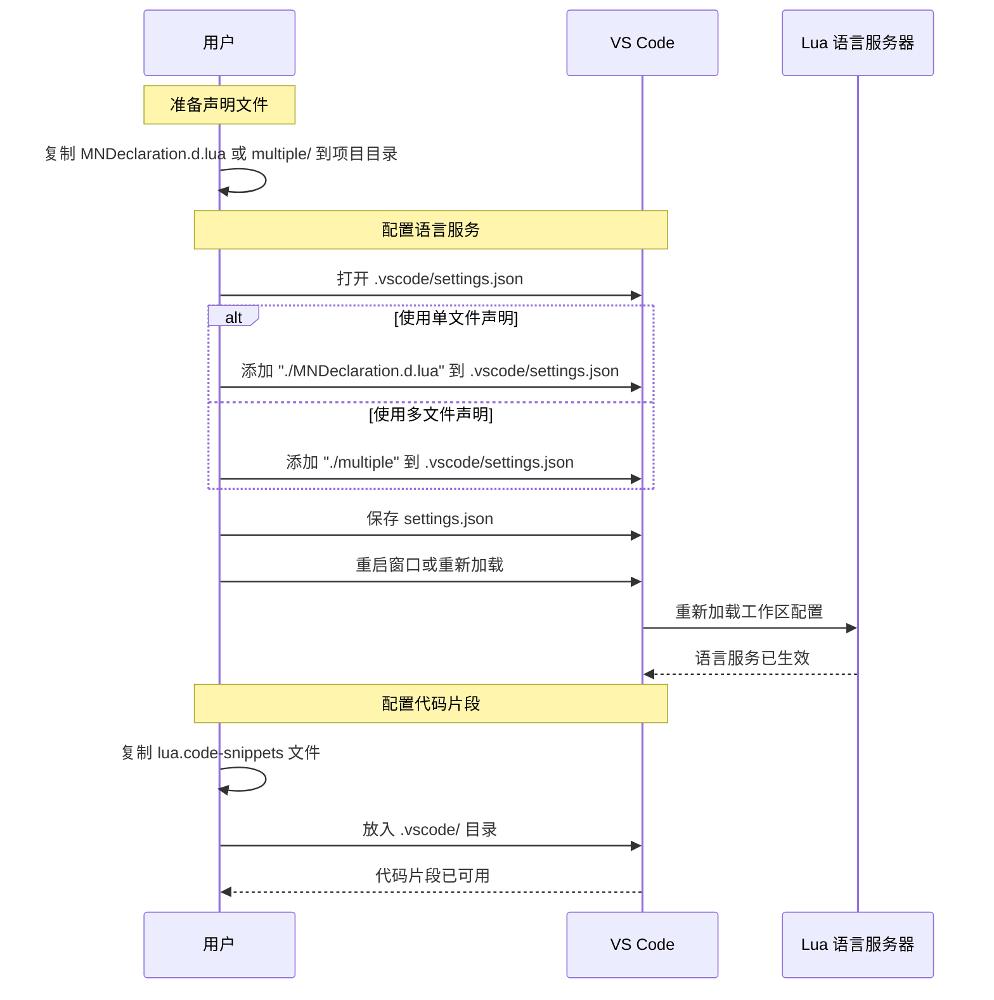

# MiniWorld-API-Desc


MiniWorld-API-Desc 是一个面向《迷你世界》UGC 3.0 Lua 开发的 API 声明库与辅助工具集。它提供模块化声明文件、代码片段模板、VS Code 扩展以及一组脚本工具，帮助你在 VS Code 中获得更好的 Lua 语法提示、补全和类型提示。

## 适用范围

- 游戏版本：v1.56+
- Lua 版本：v5.1+
- UGC 开发套件：v3.0
- 依赖环境：Python 3.10+，Node.js（用于构建插件）

## 项目特点

- 提供完整的 Lua API 声明文件，支持直接用于 VS Code 的 Lua 语言服务
- 提供单文件和多文件两种接入方式
- 预置常用代码片段，提升开发效率
- 配套 VS Code 扩展，可自动添加声明路径
- 附带对比与合并脚本，便于跟进官方 API 更新

## 目录结构

```text
MiniWorld-API-Desc/
├── .gitignore  # Git 忽略文件
├── LICENSE  # 开源协议
├── pyproject.toml  # Python 依赖管理文件
├── README.md  # 项目说明文档
├── MNDeclaration.d.lua  # 全集成声明文件，适合直接导入项目
├── .vscodeeignore  # VS Code 忽略文件
├── eslint.config.mjs  # ESLint 配置文件
├── pcakage.json  # NPM 配置文件
├── package-lock.json  # NPM 依赖管理文件
├── pack.ps1  # 打包脚本
├── tsconfig.json  # TypeScript 配置文件
├── img/  # 图片存放目录
│   └── ......  # 图片
├── AiDesc/  # AI 描述内容，便于喂给智能助手使用
│   ├── MNAiDesc.txt  # API 描述文件
│   └── AiDesc.md  # UGC 描述文件
├── multiple/  # 按模块拆分的声明文件，适合只使用部分模块时加载
│   └── ......  # 各模块声明文件
├── template/  # VS Code Lua 代码片段模板存放目录
│   └── lua.code-snippets  # 代码片段文件
├── addon/  # VS Code 补全插件
│   ├── .vscode-test.mjs  # VS Code 测试配置
│   ├── types/  # 补全文件
│   └── src/  # 补全插件源码
└── tools/  # 辅助脚本和比较工具
    ├── DescToAiDesc.py  # 生成 API 描述文件工具
    ├── EnumLibCompare.py  # 枚举比较工具
    ├── EventCompare.py  # 事件比较工具
    ├── FuncCompare.py  # 函数比较工具
    └── Merge.py  # 声明文件合并工具
```

## 安装与使用



## 快速开始

### 1. 克隆仓库

```bash
git clone https://github.com/LK-cmyk/MiniWorld-API-Desc.git
cd MiniWorld-API-Desc
```

### 2. 安装 Python 依赖

```bash
pip install -e .
```

### 3. 配置 Lua 声明路径

在 VS Code 的工作区设置中加入以下任意一种配置：

- 使用单文件声明：

```json
{
  "Lua.workspace.library": ["./MNDeclaration.d.lua"]
}
```

- 使用模块化声明：

```json
{
  "Lua.workspace.library": ["./multiple"]
}
```

保存后重载窗口，Lua 语言服务即可开始提供补全和类型提示。

### 4. 使用代码片段

将 [template/lua.code-snippets](template/lua.code-snippets) 复制到项目的 .vscode 目录下即可使用。

## VS Code 扩展使用

仓库同时提供一个简化的 VS Code 扩展，能够自动为当前工作区添加声明路径。

### 扩展命令

- MiniWorld: 添加 Lua 声明路径
- MiniWorld: 移除 Lua 声明路径

安装后，打开 Lua 项目并激活扩展即可使用。

### 构建插件

如果你想自行构建这个 VS Code 扩展插件，可以在仓库根目录执行：

```powershell
./pack.ps1
```

该脚本会依次完成以下步骤：

- 安装或更新 npm 依赖
- 编译 TypeScript 源码
- 运行 ESLint 检查
- 打包生成 VS Code 插件安装包 `.vsix`

如果只想编译而不打包，可以使用：

```powershell
./pack.ps1 -CompileOnly
```

## 工具脚本

在仓库根目录执行下列命令：

| 命令 | 说明 |
| :-- | :-- |
| `python tools/Merge.py` | 将 [multiple](multiple) 下的声明文件按预定义顺序合并为根目录下的 `merged.lua` |
| `python tools/FuncCompare.py` | 将本地声明函数与在线文档中的函数进行对比 |
| `python tools/EnumLibCompare.py` | 对比本地枚举声明与在线枚举文档 |
| `python tools/EventCompare.py` | 对比本地事件声明与在线事件文档 |
| `python tools/DescToAiDesc.py` | 生成可用于 AI 的说明文本 |

## AI 使用建议

可以将 [MNDeclaration.d.lua](MNDeclaration.d.lua)、[AiDesc/AiDesc.md](AiDesc/AiDesc.md) 或 [AiDesc/MNAiDesc.txt](AiDesc/MNAiDesc.txt) 的内容一起提供给 AI，以获得更准确的代码建议。

## 注意事项

- 该仓库声明文件、模板与扩展仅面向 UGC 3.0
- 部分接口可能与实际游戏版本存在差异，请以游戏实际行为为准
- 如发现问题，欢迎提交 Issues 或 Fork 后发起 Pull Request
