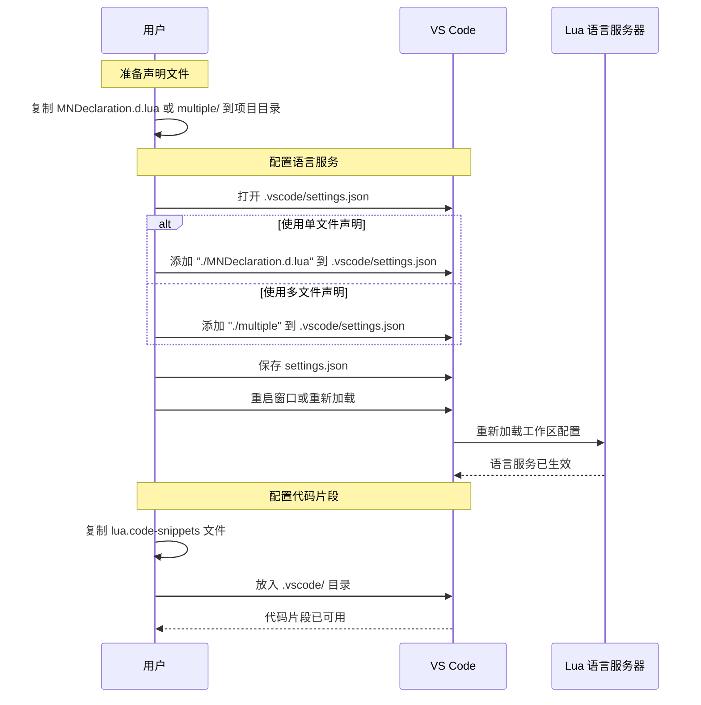

# MiniWorld-API-Desc

- 游戏版本: `v1.56+`
- `Lua` 版本: `v5.1+`
- `UGC` 开发套件: `v3.0`
- 项目工具需使用 `Python3.10`


## 项目简介

本仓库提供《迷你世界》Lua 脚本开发的 API 声明文件和代码片段模板。通过将声明文件加入 `lua.workspace.library`，可以在 VS Code 中消除语法错误提示，提升代码补全体验

## 目录说明

```shell
MiniWorld-API-Desc/
├── .gitignore  # Git 忽略文件
├── LICENSE  # 开源协议
├── pyproject.toml  # Python 依赖管理文件
├── README.md  # 项目说明文档
├── MNDeclaration.d.lua  # 全集成声明文件，适合直接导入项目
├── AiDesc/  # AI 描述内容，便于喂给智能助手使用
│   └── UGC.md  # UGC 描述文件
├── multiple/  # 按模块拆分的声明文件，适合只使用部分模块时加载
│   └── ......  # 各模块声明文件
├── template/  # VS Code Lua 代码片段模板存放目录
│   └── lua.code-snippets  # 代码片段文件
└── tools/  # 辅助脚本和比较工具
    ├── EnumLibCompare.py  # 枚举比较工具
    ├── EventCompare.py  # 事件比较工具
    ├── FuncCompare.py  # 函数比较工具
    └── Merge.py  # 声明文件合并工具
```

## 安装与使用



## 下载方式

1. 下载 ZIP：仓库页面点击绿色 "<> Code" 按钮，然后选择 "Download ZIP"
2. 克隆仓库：

    ```bash
    git clone https://github.com/LK-cmyk/MiniWorld-API-Docs.git
    ```

3. 下载单个文件：直接打开文件后点击下载按钮

## AI 使用提示

- 可将 `MNDeclaration.d.lua` / `AiDesc/MNAiDesc` 与 `AiDesc/UGC.md` 中的内容一起输入 AI，以获得更准确的代码建议

## 工具使用提示

- 进入仓库根目录，并确保已安装 **Python 3.10+**
- 对比工具依赖外部库，可通过 `pyproject.toml` 安装：

    ```bash
    pip install -e .
    ```

| 命令 | 说明 |
| :-- | :-: |
| `python tools/Merge.py` | 将 `multiple/` 中的 `.d.lua` 文件按预定义顺序合并为根目录下的 `merged.lua` |
| `python tools/EnumLibCompare.py` | 将本地 `multiple/MNEnumLib.d.lua` 与在线枚举文档对比，并输出差异 |
| `python tools/EventCompare.py` | 将本地 `multiple/MNEvent.d.lua` 与在线事件文档对比，并输出差异 |
| `python tools/FuncCompare.py` | 将本地 `multiple` 中的声明函数与在线函数文档对比，并输出差异 |
| `python tools/DescToAiDesc.py` | 将 `MNDeclaration.d.lua` 剔除对AI无用注释后，输出到 `AiDesc/` |

## 注意事项

- 本仓库声明文件与模板仅支持UGC **3.0**
- 部分接口可能与实际游戏版本存在差异，请以游戏实际行为为准
- 发现问题欢迎提交 Issues 或 Fork 后发起 PR

## Star 历史

[](https://star-history.com/#LK-cmyk/MiniWorld-API-Desc&Date)
